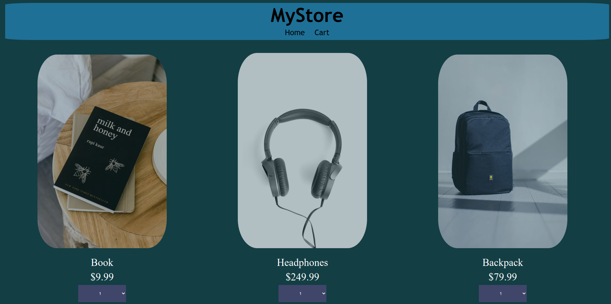

# MyStore

Note the app is for is to learning angular it doesn't contain Responsive Design

## [LiveDemo](https://mystore.abdelaziz-elshr.repl.co/)




## This Project is For Udacity Angular Cross Skills NanoDegree

## Features

  -Product list in Home page (Retrieved From JSON File)<br>
  -Product page Which contain product details.<br>
  -Adding products to cart from home page and product page.<br>
  -Change product quantity or remove it from cart.

## Instructions : >
-open terminal within the Project Directory then type ```npm i``` to install dependencies.<br>
  -then start the project by typing ```ng s```  if you need to run it with custom port type ```ng s --port (type your port here)```
